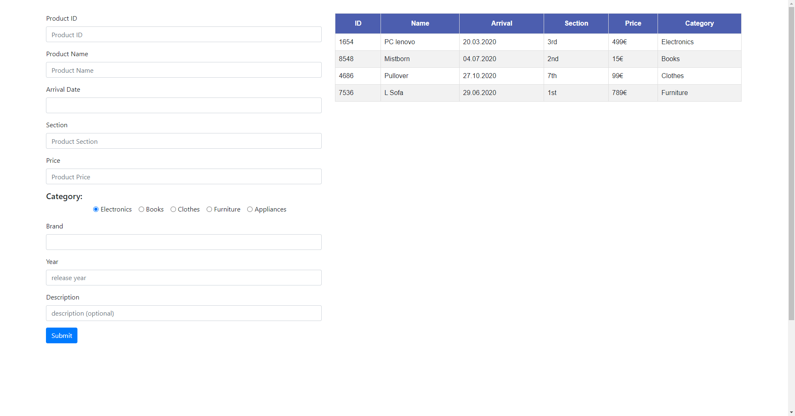
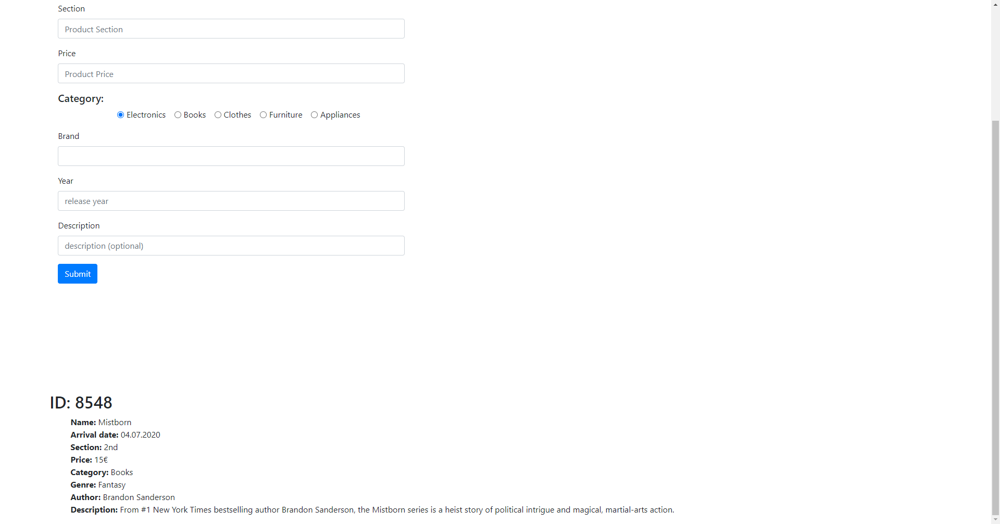

# Warehouse app
The main task for this exercise is to create a small application for recording the elements of a warehouse. The warehouse will have products with different categories and properties. The main goal is to practice the use of the prototypes. It will also be needed to use some Array and String methods.  

## Important Concepts
- function.prototype.call.[more info here](https://developer.mozilla.org/en-US/docs/Web/JavaScript/Reference/Global_Objects/Function/call)

**Rules and indications**: 
* For this task you will need to create it from scratch to practice the start of a new project. This means you need to create your html, css and javaScript files as you think needed.
* The html file should contain a table and a form. In the form you will be adding the new products and in the table you will display the products. Also below the table and form you will have a small panel to display more information of a selected product.
* The warehouse will have 5 categories of products: Electronics, Books, Clothes, Furniture, Appliances.

**Instructions**: 
* Create a function prototype for product with the following properties:
  - id: the id of the product
  - name: the name of the product
  - arrivalDate: date of arrival to the warehouse
  - section: section where the product is located in the warehouse
  - price: price of the product
  - category: category of the product
* Create a function prototype for every category of products. Each category will have all the same properties from the product prototype. This means that in the definition of the prototype will be needed to call the product prototype. For example: 
    ```
    function Book (id,name,arrivalDate,section,price,genre,author,description) {
        Product.call(this,id,name,arrivalDate,section,price,'Book')
        this.genre = genre;
        this.author = author;
        this.description = description;
    }

    Book.prototype = new Product()
    ```
* Each category will have new properties:
  - Electronic: Brand, Year, Description
  - Book: Genre, Author, Description
  - Clothes: Size, Brand, Color
  - Furniture: Color, Weight, Dimensions
  - Appliance: Dimensions, Weight, Brand

* Now with the categories prototypes made, the next task is to create the html file with the needed html elements. First create a form to add the products of the warehouse. This form should have all the product properties as inputs and then a radio button for selecting the category of the product. According to the category you will have different inputs, this part will come later when the events are created.
* Create a table to display the products but only with the product properties (id,name,arrivalDate,section,price,category). For now just create the table headers and an empty `<tbody>` to add later the products added to the warehouse.
* **BONUS:** Create a `<div>` to display all the information of a product as a list, this div should only appear when you click on a product in the table.
* Style these html elements so the look similar to the images. Feel fre to improve it.
* Create an onclick event for the radio button in which the next three inputs will change of name according to the category. For example, if Books is selected the three inputs will have Genre, Author and Description as title, then if Clothes is selected the titles should be Size, Brand, Color.
* Create the an onclick event for the submit button so everytime you fill the inputs and click submit the new product appears in the table of products. if an input is not filled then you should not pass the product to the table.
* When saving every product you should use the respective prototype, for example for submiting a book, you should use the book prototype to create the object and then save it in an array.
* **BONUS:** Create an onclick event for the table rows, in which everytime you click a row you will see the complete information of the product in a list as in the image.

**Images**




**Notes**:
* Follow the instructions to perform the task. You can add any additional styling or functionality.
* Deadline: 4hr.
* See reference images. 


